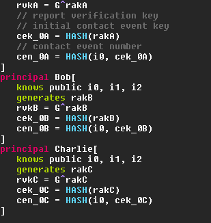

# Verifpal Language Support for Micro 2.0.x

Verifpal language support for [micro](https://micro-editor.github.io/) editor

## Installation

- copy `verifpal.yaml` file to `~/.config/micro/syntax/`
- copy `init.lua` file to `~/.config/micro/`. Or only 'if' block if you already have `init.lua` file
- copy content of `settings.json` file to setup filetype detection. Respect json format

## Features

- verifpal syntax highlighting
- run model verification inside editor by `Ctrl-R`

## Screenshot

Example in default color scheme:

